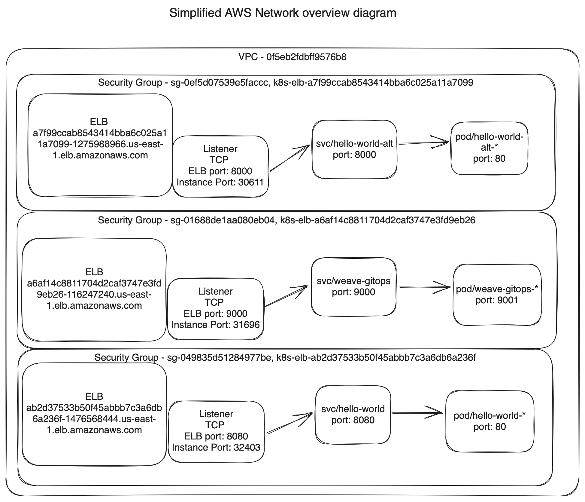
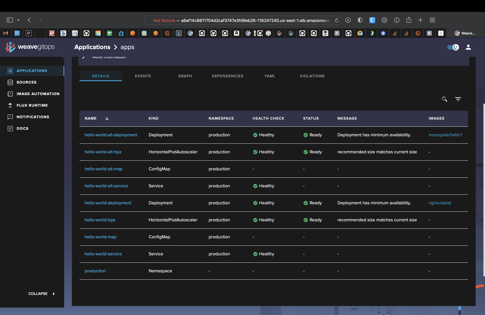
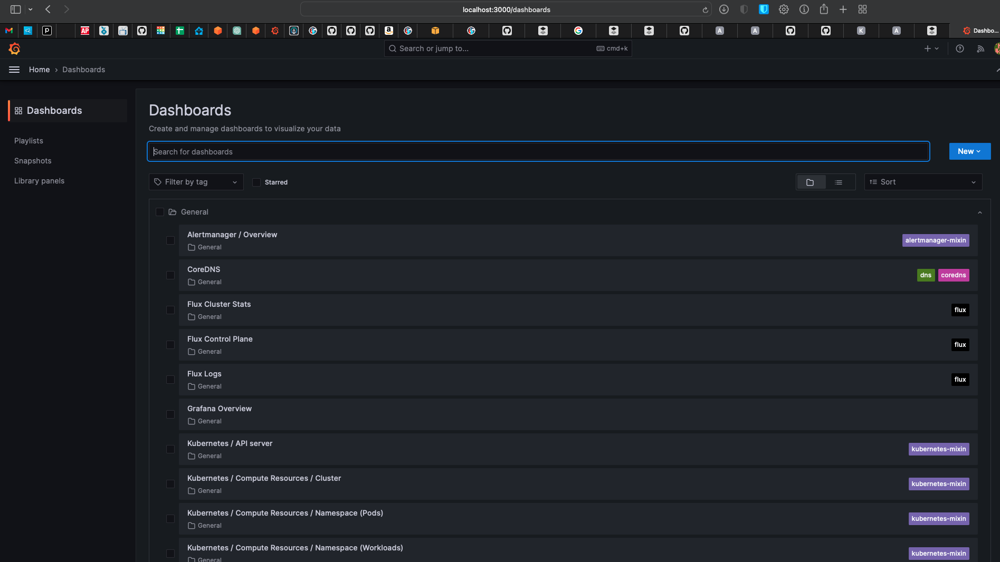
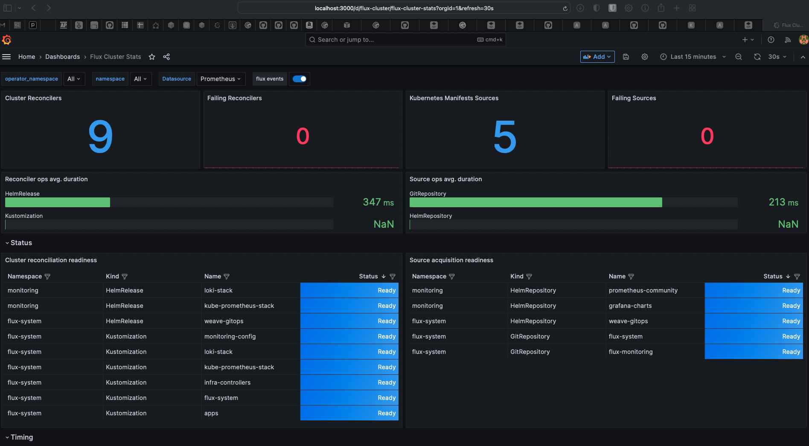
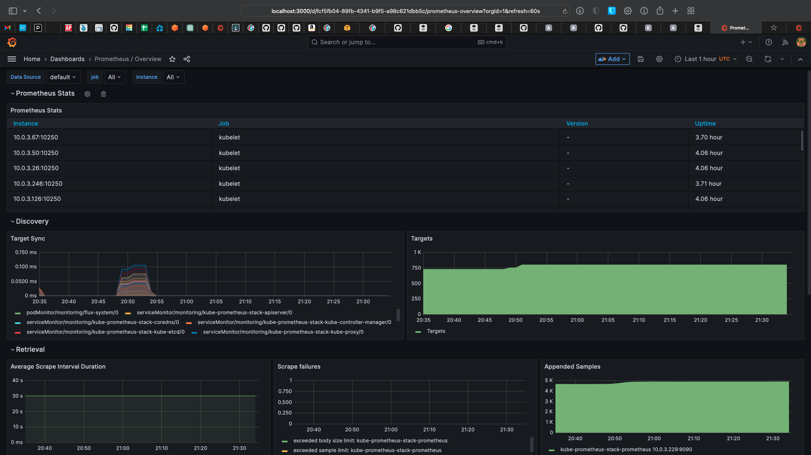

# graylog-hello
Graylog Hello World project

## Overview ##
The purpose of this project is to set up an example EKS kubernetes cluster in AWS utilizing several example technologies such as:
Kustomize, FluxCD, Prometheus, Grafana, Weave Gitops.

There are several areas that could be improved both for performance and security concerns that were created in an abbreviated form for this proof of concept. This is expanded upon in the TODO section later in this Readme.

Terraform was used for EKS cluster and bare-minimum VPC networking creation. 
Scripts in the `flux/bootstrap-scripts` folder were used to bootstrap the installation of FluxCD and the Promethus monitoring stack.

The `apps`, `cluster`, and `infrastructure` sub-folders are structured based on the [FluxCD structure guide](https://fluxcd.io/flux/guides/repository-structure/) with some minor modifications. The `apps` folder shows an example of a kustomize overlay pattern with a `base` folder and an `production` 'overlay' which modifies the namespace the app runs in. This is controlled and reconciled against the git repository by the Flux Kustomization resource in `flux/cluster/graylog-eks/apps`. Other Kustomizations could be added here for other test, staging, etc. environments 


### Installation and initial setup ###

This repository will make use of the following tools at these versions. Specific install and configuration instructions included later

AWS CLI - v2.13.5  
Terraform - v1.5.4  
kubectl - v1.27.4  
flux - v2.0.1  


#### awscli configuration ####

- Run `aws configure --profile graylog-eks`
- Enter access key information and set default region to `us-east-1`
- Generate ec2 access keys `aws ec2 create-key-pair --key-name graylog-keypair --query 'KeyMaterial' --output text --profile graylog-eks > ./graylog-eks-key.pem`
- Set permissions on private key `chmod 400 graylog-eks-key.pem`

#### Terraform configuration ####
- If running on an m1 mac and using tfenv be sure to specify `TFENV_ARCH=arm64`
- Change to the terraform directory `cd ./terraform`
- Run `terraform init`
- Run `AWS_PROFILE=graylog-eks terraform plan -out graylog-eks-plan`
- Run `AWS_PROFILE=graylog-eks terraform apply graylog-eks-plan`

### Kubectl config ###
- Install or update kubectl if needed: https://kubernetes.io/docs/tasks/tools/install-kubectl-macos/
- Update kubeconfig with eks cluster context `aws eks --region us-east-1 update-kubeconfig --name graylog-eks-cluster --profile graylog-eks`
- Test access: `kubectl get ns`

```
  NAME              STATUS   AGE
  default           Active   19m
  kube-node-lease   Active   19m
  kube-public       Active   19m
  kube-system       Active   19m
 ```

### Flux bootstrap ###

- Setup credentials:
    - `export GITHUB_TOKEN=<token>`
    - `export GITHUB_USER=<username>`

### Simplified AWS network diagram ###


### Repo structure diagram ###
```
terraform

flux
├── bootstrap-scripts
│
├── apps
│   ├── base
│   └── production
│
├── infrastructure
│   └── controllers
│   
└── cluster
    └── graylog-eks
```

### URLS ###
[Weave Gitops](http://a6af14c8811704d2caf3747e3fd9eb26-116247240.us-east-1.elb.amazonaws.com:9000/applications)  
username: admin  
password: in email  



[Hello World](http://ab2d37533b50f45abbb7c3a6db6a236f-1476568444.us-east-1.elb.amazonaws.com:8080)  
[Alternate Hello World](http://a7f99ccab8543414bba6c025a11a7099-1275988966.us-east-1.elb.amazonaws.com:8000) - will reflect any uri as well (eg. /healthz)

### Grafana ###
 - Connect using kube-proxy due to lack of ingress: `kubectl -n monitoring port-forward svc/kube-prometheus-stack-grafana 3000:80`
   






### Pod autoscaling ###
```45m         Normal   Killing            Pod/hello-world-alt-deployment-f4685d744-wqtvm     Stopping container hello-world-alt-container
56m         Normal   SuccessfulDelete   ReplicaSet/hello-world-alt-deployment-f4685d744    Deleted pod: hello-world-alt-deployment-f4685d744-cqrl4
56m         Normal   SuccessfulDelete   ReplicaSet/hello-world-alt-deployment-f4685d744    Deleted pod: hello-world-alt-deployment-f4685d744-5p4xk
51m         Normal   SuccessfulCreate   ReplicaSet/hello-world-alt-deployment-f4685d744    Created pod: hello-world-alt-deployment-f4685d744-nw5jt
51m         Normal   SuccessfulCreate   ReplicaSet/hello-world-alt-deployment-f4685d744    Created pod: hello-world-alt-deployment-f4685d744-wqtvm
45m         Normal   SuccessfulDelete   ReplicaSet/hello-world-alt-deployment-f4685d744    Deleted pod: hello-world-alt-deployment-f4685d744-nw5jt
45m         Normal   SuccessfulDelete   ReplicaSet/hello-world-alt-deployment-f4685d744    Deleted pod: hello-world-alt-deployment-f4685d744-wqtvm
45m (x3 over 70m)   Normal   ScalingReplicaSet   Deployment/hello-world-alt-deployment              Scaled down replica set hello-world-alt-deployment-f4685d744 to 1 from 3
51m (x2 over 61m)   Normal   ScalingReplicaSet   Deployment/hello-world-alt-deployment              Scaled up replica set hello-world-alt-deployment-f4685d744 to 3 from 1
42m                 Normal   ScalingReplicaSet   Deployment/hello-world-alt-deployment              Scaled up replica set hello-world-alt-deployment-7fcddccd86 to 1
45m (x2 over 56m)   Normal   SuccessfulRescale   HorizontalPodAutoscaler/hello-world-alt-hpa        New size: 1; reason: All metrics below target```
```

### TODO ##
 - Add ingress-nginx controllers
 - Add cert-manager and letsencrypt
 - Add persistent volumes and volume claims for long-term storage
 - Add secrets management
 - Cluster autoscaler implementation
 - Create imperative manifests for prometheus stack from bootstrapped kustomization

### Cluster Resources ###
```
NAMESPACE       NAME                                                            READY   STATUS    RESTARTS   AGE
flux-system     pod/helm-controller-74b5f87d94-s9qfc                            1/1     Running   0          173m
flux-system     pod/kustomize-controller-59d4cb8bc6-wxbst                       1/1     Running   0          173m
flux-system     pod/notification-controller-b7d8566b7-jmsjw                     1/1     Running   0          173m
flux-system     pod/source-controller-645656595b-dtwpn                          1/1     Running   0          173m
flux-system     pod/weave-gitops-59cb75df6b-6rx27                               1/1     Running   0          113m
kube-system     pod/aws-node-2h9bl                                              1/1     Running   0          3h25m
kube-system     pod/aws-node-62grd                                              1/1     Running   0          3h46m
kube-system     pod/aws-node-7n2ds                                              1/1     Running   0          3h46m
kube-system     pod/aws-node-9xs9h                                              1/1     Running   0          3h46m
kube-system     pod/aws-node-bpgrk                                              1/1     Running   0          3h46m
kube-system     pod/aws-node-dqjn6                                              1/1     Running   0          3h46m
kube-system     pod/aws-node-dqzpg                                              1/1     Running   0          3h46m
kube-system     pod/aws-node-h9k8z                                              1/1     Running   0          3h46m
kube-system     pod/aws-node-mffgt                                              1/1     Running   0          29m
kube-system     pod/aws-node-n24jn                                              1/1     Running   0          29m
kube-system     pod/aws-node-njslx                                              1/1     Running   0          174m
kube-system     pod/aws-node-nx2lp                                              1/1     Running   0          3h46m
kube-system     pod/aws-node-psnzm                                              1/1     Running   0          3h46m
kube-system     pod/aws-node-q2j54                                              1/1     Running   0          3h46m
kube-system     pod/aws-node-sb7b6                                              1/1     Running   0          3h46m
kube-system     pod/aws-node-tc2cs                                              1/1     Running   0          174m
kube-system     pod/aws-node-tmh4b                                              1/1     Running   0          3h25m
kube-system     pod/coredns-55b488b5d8-5rzdj                                    1/1     Running   0          3h45m
kube-system     pod/coredns-55b488b5d8-dlb25                                    1/1     Running   0          13h
kube-system     pod/kube-proxy-5f8fm                                            1/1     Running   0          3h46m
kube-system     pod/kube-proxy-5rxkd                                            1/1     Running   0          3h46m
kube-system     pod/kube-proxy-9znrb                                            1/1     Running   0          29m
kube-system     pod/kube-proxy-c84vg                                            1/1     Running   0          3h46m
kube-system     pod/kube-proxy-dszcz                                            1/1     Running   0          3h25m
kube-system     pod/kube-proxy-dxzbm                                            1/1     Running   0          3h46m
kube-system     pod/kube-proxy-f5vfk                                            1/1     Running   0          3h46m
kube-system     pod/kube-proxy-hmknp                                            1/1     Running   0          3h46m
kube-system     pod/kube-proxy-hxppl                                            1/1     Running   0          174m
kube-system     pod/kube-proxy-ktdkg                                            1/1     Running   0          3h46m
kube-system     pod/kube-proxy-kzh4p                                            1/1     Running   0          3h25m
kube-system     pod/kube-proxy-lmg8h                                            1/1     Running   0          3h46m
kube-system     pod/kube-proxy-qrkbg                                            1/1     Running   0          29m
kube-system     pod/kube-proxy-s8pb4                                            1/1     Running   0          3h46m
kube-system     pod/kube-proxy-w4888                                            1/1     Running   0          3h46m
kube-system     pod/kube-proxy-w68hn                                            1/1     Running   0          174m
kube-system     pod/kube-proxy-wtpbm                                            1/1     Running   0          3h46m
kube-system     pod/metrics-server-5d875656f5-z6lcg                             1/1     Running   0          50m
monitoring      pod/kube-prometheus-stack-grafana-6b47849ddb-dznl4              3/3     Running   0          13h
monitoring      pod/kube-prometheus-stack-kube-state-metrics-7dff96c957-gg9nv   1/1     Running   0          13h
monitoring      pod/kube-prometheus-stack-operator-6cbc867d96-6jb7m             1/1     Running   0          13h
monitoring      pod/kube-prometheus-stack-prometheus-node-exporter-48nd2        1/1     Running   0          3h46m
monitoring      pod/kube-prometheus-stack-prometheus-node-exporter-6tgzm        1/1     Running   0          3h46m
monitoring      pod/kube-prometheus-stack-prometheus-node-exporter-7nm4t        1/1     Running   0          3h25m
monitoring      pod/kube-prometheus-stack-prometheus-node-exporter-8v5ng        1/1     Running   0          29m
monitoring      pod/kube-prometheus-stack-prometheus-node-exporter-b9ws8        1/1     Running   0          3h46m
monitoring      pod/kube-prometheus-stack-prometheus-node-exporter-bxpzl        1/1     Running   0          3h46m
monitoring      pod/kube-prometheus-stack-prometheus-node-exporter-cf2mm        1/1     Running   0          3h46m
monitoring      pod/kube-prometheus-stack-prometheus-node-exporter-ctqb2        1/1     Running   0          3h46m
monitoring      pod/kube-prometheus-stack-prometheus-node-exporter-dft9m        1/1     Running   0          3h25m
monitoring      pod/kube-prometheus-stack-prometheus-node-exporter-gxpnb        1/1     Running   0          3h46m
monitoring      pod/kube-prometheus-stack-prometheus-node-exporter-h4lbl        1/1     Running   0          3h46m
monitoring      pod/kube-prometheus-stack-prometheus-node-exporter-m6c2w        1/1     Running   0          29m
monitoring      pod/kube-prometheus-stack-prometheus-node-exporter-nv4cd        1/1     Running   0          174m
monitoring      pod/kube-prometheus-stack-prometheus-node-exporter-pjg7v        1/1     Running   0          3h46m
monitoring      pod/kube-prometheus-stack-prometheus-node-exporter-rjfrk        1/1     Running   0          3h46m
monitoring      pod/kube-prometheus-stack-prometheus-node-exporter-vjgl7        1/1     Running   0          174m
monitoring      pod/kube-prometheus-stack-prometheus-node-exporter-wv4q2        1/1     Running   0          3h46m
monitoring      pod/loki-stack-0                                                1/1     Running   0          13h
monitoring      pod/loki-stack-promtail-2qgs5                                   1/1     Running   0          3h46m
monitoring      pod/loki-stack-promtail-bnzg2                                   1/1     Running   0          3h46m
monitoring      pod/loki-stack-promtail-c72rp                                   1/1     Running   0          29m
monitoring      pod/loki-stack-promtail-ccnzl                                   1/1     Running   0          29m
monitoring      pod/loki-stack-promtail-dw5z4                                   1/1     Running   0          3h46m
monitoring      pod/loki-stack-promtail-dzz4t                                   1/1     Running   0          174m
monitoring      pod/loki-stack-promtail-fpk9n                                   1/1     Running   0          3h46m
monitoring      pod/loki-stack-promtail-h8l6z                                   1/1     Running   0          3h46m
monitoring      pod/loki-stack-promtail-hd2bv                                   1/1     Running   0          3h46m
monitoring      pod/loki-stack-promtail-j6p87                                   1/1     Running   0          3h46m
monitoring      pod/loki-stack-promtail-pwkxw                                   1/1     Running   0          3h24m
monitoring      pod/loki-stack-promtail-qkh82                                   1/1     Running   0          3h25m
monitoring      pod/loki-stack-promtail-rmntl                                   1/1     Running   0          3h46m
monitoring      pod/loki-stack-promtail-t7jfn                                   1/1     Running   0          3h46m
monitoring      pod/loki-stack-promtail-w4jsm                                   1/1     Running   0          3h46m
monitoring      pod/loki-stack-promtail-xg4gh                                   1/1     Running   0          173m
monitoring      pod/loki-stack-promtail-zv9s2                                   1/1     Running   0          3h46m
monitoring      pod/prometheus-kube-prometheus-stack-prometheus-0               2/2     Running   0          13h
production      pod/hello-world-alt-deployment-7fcddccd86-4qcq8                 1/1     Running   0          14m
production      pod/hello-world-deployment-67666c6bcc-s5d7r                     1/1     Running   0          88m

NAMESPACE       NAME                                                     TYPE           CLUSTER-IP       EXTERNAL-IP                                                               PORT(S)                        AGE
default         service/kubernetes                                       ClusterIP      172.20.0.1       <none>                                                                    443/TCP                        22h
flux-system     service/notification-controller                          ClusterIP      172.20.174.181   <none>                                                                    80/TCP                         173m
flux-system     service/source-controller                                ClusterIP      172.20.223.149   <none>                                                                    80/TCP                         173m
flux-system     service/weave-gitops                                     LoadBalancer   172.20.16.132    a6af14c8811704d2caf3747e3fd9eb26-116247240.us-east-1.elb.amazonaws.com    9000:31696/TCP                 113m
flux-system     service/webhook-receiver                                 ClusterIP      172.20.105.34    <none>                                                                    80/TCP                         173m
kube-system     service/kube-dns                                         ClusterIP      172.20.0.10      <none>                                                                    53/UDP,53/TCP                  22h
kube-system     service/kube-prometheus-stack-coredns                    ClusterIP      None             <none>                                                                    9153/TCP                       13h
kube-system     service/kube-prometheus-stack-kube-controller-manager    ClusterIP      None             <none>                                                                    10257/TCP                      13h
kube-system     service/kube-prometheus-stack-kube-etcd                  ClusterIP      None             <none>                                                                    2381/TCP                       13h
kube-system     service/kube-prometheus-stack-kube-proxy                 ClusterIP      None             <none>                                                                    10249/TCP                      13h
kube-system     service/kube-prometheus-stack-kube-scheduler             ClusterIP      None             <none>                                                                    10259/TCP                      13h
kube-system     service/kube-prometheus-stack-kubelet                    ClusterIP      None             <none>                                                                    10250/TCP,10255/TCP,4194/TCP   19h
kube-system     service/metrics-server                                   ClusterIP      172.20.204.122   <none>                                                                    443/TCP                        50m
monitoring      service/kube-prometheus-stack-grafana                    ClusterIP      172.20.224.45    <none>                                                                    80/TCP                         13h
monitoring      service/kube-prometheus-stack-kube-state-metrics         ClusterIP      172.20.251.9     <none>                                                                    8080/TCP                       13h
monitoring      service/kube-prometheus-stack-operator                   ClusterIP      172.20.102.15    <none>                                                                    443/TCP                        13h
monitoring      service/kube-prometheus-stack-prometheus                 ClusterIP      172.20.60.247    <none>                                                                    9090/TCP                       13h
monitoring      service/kube-prometheus-stack-prometheus-node-exporter   ClusterIP      172.20.92.134    <none>                                                                    9100/TCP                       13h
monitoring      service/loki-stack                                       ClusterIP      172.20.119.220   <none>                                                                    3100/TCP                       13h
monitoring      service/loki-stack-headless                              ClusterIP      None             <none>                                                                    3100/TCP                       13h
monitoring      service/loki-stack-memberlist                            ClusterIP      None             <none>                                                                    7946/TCP                       13h
monitoring      service/prometheus-operated                              ClusterIP      None             <none>                                                                    9090/TCP                       13h
production      service/hello-world-alt-service                          LoadBalancer   172.20.207.234   a7f99ccab8543414bba6c025a11a7099-1275988966.us-east-1.elb.amazonaws.com   8000:30611/TCP                 33m
production      service/hello-world-service                              LoadBalancer   172.20.41.214    ab2d37533b50f45abbb7c3a6db6a236f-1476568444.us-east-1.elb.amazonaws.com   8080:32402/TCP                 88m

NAMESPACE     NAME                                                            DESIRED   CURRENT   READY   UP-TO-DATE   AVAILABLE   NODE SELECTOR   AGE
kube-system   daemonset.apps/aws-node                                         17        17        17      17           17          <none>          22h
kube-system   daemonset.apps/kube-proxy                                       17        17        17      17           17          <none>          22h
monitoring    daemonset.apps/kube-prometheus-stack-prometheus-node-exporter   17        17        17      17           17          <none>          13h
monitoring    daemonset.apps/loki-stack-promtail                              17        17        17      17           17          <none>          13h

NAMESPACE       NAME                                                       READY   UP-TO-DATE   AVAILABLE   AGE                    1/1     1            1           16h
flux-system     deployment.apps/helm-controller                            1/1     1            1           173m
flux-system     deployment.apps/kustomize-controller                       1/1     1            1           173m
flux-system     deployment.apps/notification-controller                    1/1     1            1           173m
flux-system     deployment.apps/source-controller                          1/1     1            1           173m
flux-system     deployment.apps/weave-gitops                               1/1     1            1           113m
kube-system     deployment.apps/coredns                                    2/2     2            2           22h
kube-system     deployment.apps/metrics-server                             1/1     1            1           50m
monitoring      deployment.apps/kube-prometheus-stack-grafana              1/1     1            1           13h
monitoring      deployment.apps/kube-prometheus-stack-kube-state-metrics   1/1     1            1           13h
monitoring      deployment.apps/kube-prometheus-stack-operator             1/1     1            1           13h
production      deployment.apps/hello-world-alt-deployment                 1/1     1            1           14m
production      deployment.apps/hello-world-deployment                     1/1     1            1           88m

NAMESPACE       NAME                                                                  DESIRED   CURRENT   READY   AGE
flux-system     replicaset.apps/helm-controller-74b5f87d94                            1         1         1       173m
flux-system     replicaset.apps/kustomize-controller-59d4cb8bc6                       1         1         1       173m
flux-system     replicaset.apps/notification-controller-b7d8566b7                     1         1         1       173m
flux-system     replicaset.apps/source-controller-645656595b                          1         1         1       173m
flux-system     replicaset.apps/weave-gitops-59cb75df6b                               1         1         1       113m
kube-system     replicaset.apps/coredns-55b488b5d8                                    2         2         2       22h
kube-system     replicaset.apps/coredns-79df7fff65                                    0         0         0       22h
kube-system     replicaset.apps/metrics-server-5d875656f5                             1         1         1       50m
monitoring      replicaset.apps/kube-prometheus-stack-grafana-6b47849ddb              1         1         1       13h
monitoring      replicaset.apps/kube-prometheus-stack-kube-state-metrics-7dff96c957   1         1         1       13h
monitoring      replicaset.apps/kube-prometheus-stack-operator-6cbc867d96             1         1         1       13h
production      replicaset.apps/hello-world-alt-deployment-7fcddccd86                 1         1         1       14m
production      replicaset.apps/hello-world-deployment-67666c6bcc                     1         1         1       88m

NAMESPACE    NAME                                                           READY   AGE
monitoring   statefulset.apps/loki-stack                                    1/1     13h
monitoring   statefulset.apps/prometheus-kube-prometheus-stack-prometheus   1/1     13h

NAMESPACE    NAME                                                      REFERENCE                               TARGETS   MINPODS   MAXPODS   REPLICAS   AGE
production   horizontalpodautoscaler.autoscaling/hello-world-alt-hpa   Deployment/hello-world-alt-deployment   0%/50%    1         10        1          33m
production   horizontalpodautoscaler.autoscaling/hello-world-hpa       Deployment/hello-world-deployment       0%/50%    1         10        1          88m
```


### References ###
[Flux - Getting Started](https://fluxcd.io/flux/get-started/)  
[Flux - Install Prometheus](https://fluxcd.io/flux/guides/monitoring/)  
[Flux - Example repository structure](https://github.com/fluxcd/flux2-kustomize-helm-example/tree/main)
[Pod Autoscaling](https://kubernetes.io/docs/tasks/run-application/horizontal-pod-autoscale-walkthrough/)  
[Hello World pod example](https://github.com/kubernetes-sigs/kustomize/blob/master/examples/helloWorld/deployment.yaml)  